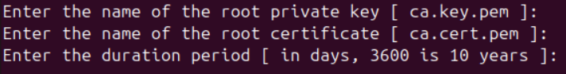
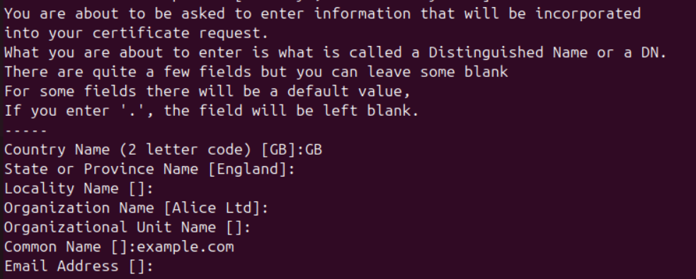
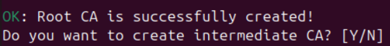
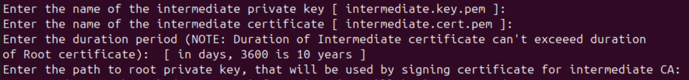

# 🔐 **crt_manager toolkit**


# **Description**
A Bash-based SSL/TLS management toolkit that streamlines the entire certificate lifecycle. It enables you to create Root and Intermediate Certificate Authorities (CAs), generate private keys and CSRs, issue and revoke certificates, verify and validate PKI components across formats (PEM, DER, PFX), convert certificate formats for compatibility, fetch certificates from remote servers, and monitor expiry dates to prevent outages — all from a lightweight, command-line solution ideal for DevOps, SysAdmins, and security-conscious environments. The CA creation scripts in this toolkit are based on best practices outlined in the excellent [JamieLinux OpenSSL Certificate Authority guide](https://jamielinux.com/docs/openssl-certificate-authority/).

## Table of Contents
- [Features](#features)
- [Instalation](#installation)
- [Requirements](#requirements)
- [Project Stucture](#project-stucture)
- [Documentation](#-documentation)
    - [1. Create Certificate Authority (CA)](#1-create-certificate-authority-ca)
        - [1.1. Create Root CA](#11-create-root-ca)
        - [1.2 Create Intermediate CA](#12-create-intermediate-ca)
    - [2. CRT_MANAGER](#2-crt_manager)
        - [Features](#features-1)
        - [Usage](#usage)
    - [3. Is Expired](#3-is-expired)


# **Features**

## Certificate Authority Management
- **Create Root or Intermediate CA** – Initialize your own Root Certificate Authority and add an intermediate CA for secure chaining

##  Certificate Lifecycle
- **Generate Private Key** – Create RSA or ECC private keys
- **Generate CSR** – Create Certificate Signing Requests
- **Issue Certificate** – Sign certificates using your CA
- **Revoke Certificate** – Invalidate compromised or expired certificates
- **Verify CSR, Private Key, and Certificate** – Ensure validity across PEM, PFX, and DER formats
- **Check Private Key and Certificate Match** – Confirm key-certificate pairing
- **Convert Certificate Formats** – Convert between PEM, DER, and PFX
- **Fetch Certificate from Resource** – Pull a certificate from a remote server
- **Check Certificate Expiry** – Validate if certificates in a list are about to expire


# **Installation**
```bash
# Clone repo
git clone https://github.com/bogdantepavcevic/crt_manager.git

# Enter directory
cd crt_manager

# Add executable permition
chmod +x crt_manager.sh
chmod +x cacreation.sh
```

# **Requirements**
- OpenSSL installed 
- Run as root (only for CA creation)


# **Project Stucture**
```
crt_manager/
├── CA/
│ ├── config/
│ │ ├── openssl-rootCA.cnf
│ │ └── openssl.cnf
│ └── scripts/
│ ├── intermediateCAcreation.sh
│ └── rootCAcreation.sh
├── LICENSE
├── README.md
├── cacreation.sh
├── certsList.txt
├── crt_manager.sh
└── isExpire.sh 
```

# 🚀 **Documentation**

## **1. Create Certificate Authority (CA)**


The cacreation.sh script helps you set up a Root or Intermediate Certificate Authority to build a complete PKI hierarchy. S

```bash
# Run from the project root
./cacreation.sh
```


- If first option is selected (1), you can create secure and robust multi-tier PKI environment using both a Root and one or more Intermediate CAs. Alternatlively, the  Root CA alone can be used as a simple Self-signed CA for lab and testing purposes, this is not recommended in production environment. 

- The second option (2) creates an Intermediate CA, but only if you already have a Root CA in place.

- You can also mannualy run scripts for create of Root and Intermediate CA from CA/scripts/ directory (rootCAcreation, intermediatCAcreation). However, ./cacreation.sh is recommended since it checks prerequisites before running.

### 1.1. Create Root CA

### Specify directory to store Root CA
When you run the script to create a Root CA, you will first be prompted to specify a directory where all important Root CA information will be stored.  
This directory will contain:

- certs/ – stores issued certificates
- crl/ – holds Certificate Revocation Lists
- newcerts/ – location for newly issued certificates
- private/ – stores the private key of the Root CA (keep this secure!)
- index.txt – a flat-file database that tracks issued certificates
- serial – maintains the serial number for the next certificate to be issued

**Note:** By default, if user doesn't specify other path, Root CA directory will be stored on /root/ca path.

This structure is essential for managing your Root CA and ensuring traceability of all issued certificates. All necessary  files and directories will be created automatically by scripts.

### Configure openssl.cnf

Next step is configuration of openssl.cnf file which is crucial for generating Certificate Signing Requests (CSR), issuing certificates (signing the CSR), revoke certificates. In the directory CA/config/ are stored default config files (openssl-rootCA.cnf, openssl.cnf).

**Note:** By default, if user doesn't specify other file, openssl-rootCA.cnf will be used.

If you choose default option (simply by press ENTER) you will be prompted to edit openssl-rootCA.cnf. If you enter Y/y file will be open with nano text editor. After finish editing simple pres CTRL+X, then Y and ENTER.  

In most cases, the default OpenSSL configuration will work fine.
```
# This is default path necessary for Root CA and you do not need to change it 
[ CA_default ]
# Directory and file locations.
dir               = /root/ca
certs             = $dir/certs
crl_dir           = $dir/crl
new_certs_dir     = $dir/newcerts
database          = $dir/index.txt
serial            = $dir/serial
RANDFILE          = $dir/private/.rand


# This is section that you can adpot to your organization
# Optionally, specify some defaults.
countryName_default             = GB
stateOrProvinceName_default     = England
localityName_default            =
0.organizationName_default      = Alice Ltd
organizationalUnitName_default  =
emailAddress_default            =
```
📌 Tip:

The CA_default section defines file system paths for your CA (leave unchanged unless you know what you’re doing).

The organization details (countryName, organizationName, etc.) can be updated to match your company or personal CA setup.

### Create root private key and self-signed root certificate

The Root Certification Authority (CA) sits at the top of the PKI trust chain, root certificate is self-signed and is used only to issue Intermediate CA certificates (in production enironment, never directly for end-entities like servers and users). Because the Root CA is critical, its certificate should have a long validity period (commonly 10–20 years).

Then, you will be prompted to enter the future name of private key and certificate and duration period for Root CA, if you leave the fields empty,the default value shown in [] will be applied automatically.



After that, you will be asked to enter the information (two-letters country code define by ISO standard, State, Organization Name, Common Name-**name of the certicicate**... ) that will be incorporated into your certificate:



If you get this OK message, Root CA is successfully created.



At the end, you will prompted would you like to create Intermediate CA.

### 1.2 Create Intermediate CA 

You have 3 options to start script for create Intermediate CA: 
1. Run cacreation.sh and select option 2 from the menu.
2. During Root CA creation (rootCAcreation.sh), you will be asked wheter you want to run intermediateCAcreation.sh.
3. Manually run script located at: 
``` bash
CA/scripts/intermediateCAcreation.sh
```
### Specify directory to store Intermediate CA
When running the script to create an Intermediate CA, you will first be asked to specify a directory where all Intermediate CA data will be stored. 
This directory will contain:

- certs/ – stores issued certificates
- crl/ – holds Certificate Revocation Lists
- newcerts/ – location for newly issued certificates
- private/ – stores the private key of the Intermediate CA (keep this secure!)
- index.txt – a flat-file database that tracks issued certificates
- serial – maintains the serial number for the next certificate to be issued

**Note:** If no custom path is provided, the default directory is /intermediate/ca.

The script automatically creates all required files and directories, ensuring the Intermediate CA is properly initialized and ready to issue certificates.


### Configure openssl.cnf for Intermediate CA

The next step is configuring the openssl.cnf file, for Intermediate CA, which is crucial for generating Certificate Signing Requests (CSR), issuing certificates (signing the CSR), revoke certificates. 

**Note:** By default, if user doesn't specify other file, CA/config/openssl.cnf will be used.

If you choose default option (simply by press ENTER) you will be prompted to edit openssl.cnf. If you enter Y/y file will be open with nano text editor. After finish editing simple pres CTRL+X, then Y and ENTER.  

For Intermediate CA openssl configuration file define what certificate used for, by specify it in req module or in signing certificate module server_cert/usr_cert. Also if you need to add Subject Alternative Name (SAN) you can do it through req module.

**Note:** All modern browsers require the SAN field to include the CN, otherwise browser reports error. For example, if you have certificate for CN=example.com, the SAN must also contain example.com.


```
# This is default path necessary for Intermediate CA and you do not need to change it 
[ CA_default ]
# Directory and file locations.
dir               = /root/intermediate
certs             = $dir/certs
crl_dir           = $dir/crl
new_certs_dir     = $dir/newcerts
database          = $dir/index.txt
serial            = $dir/serial
RANDFILE          = $dir/private/.rand

# This is section that you can adpot to your organization
# Optionally, specify some defaults.
countryName_default             = GB
stateOrProvinceName_default     = England
localityName_default            =
0.organizationName_default      = Alice Ltd
organizationalUnitName_default  =
emailAddress_default            =
```

Here you can define informations about Certificate Signing Request (CSR). Certificate can be used for server authentication, client authentication (in mTLS), or both. You need to uncomment line for extendedKeyUsage, subjectAltName and in module [alt_names] you can define alternative name FQDN or IP address.

```
[ req ]
# Options for the `req` tool (`man req`).
default_bits        = 2048
distinguished_name  = req_distinguished_name
string_mask         = utf8only

# SHA-1 is deprecated, so use SHA-2 instead.
default_md          = sha256

# Extension to add when the -x509 option is used.
x509_extensions     = v3_ca

# Select one of this two option, or both to specify what certificate used for
#extendedKeyUsage	= serverAuth, clientAuth

# Add Subject Alternative Name (SAN)
#subjectAltName	= @alt_names


#[alt_names]
#DNS.1	= example1.com
#DNS.2	= example2.com
#IP.1	= 1.1.1.1
```


⚠️ WARNING:

To generate the Root CA certificate, create a CSR and sign it with the Root CA private key using openssl-rootCA.cnf. For the Intermediate CA, generate the CSR with openssl.cnf (configured for Intermediate CA) and sign it using the Root private key and Root CA with openssl-rootCA.cnf. Once the Intermediate CA is created, use its own openssl.cnf to issue and sign server and client certificates. CSRs for server or client certificates can be created on any machine with OpenSSL, but if you generate them on this server, they should be signed using the Intermediate CA configuration (openssl.cnf).


### Create intermediate private key and certificate signed by Root CA 

The Intermediate Certification Authority (CA) is created for signing server and client certificates. Certificate for Intermediate CA is signed by Root CA. 

Aftr you finished editing of openssl.cnf file, you will be prompted to enter the future name of private key and certificate and duration period for Intermediate CA, if you leave the fields empty,the default value shown in [] will be applied automatically, also you need to prepare private key for Root CA.



**Note:** Duration period of Intermediate CA certificate can't exceed duration of Root CA certificate. 

After that, you will be asked to enter the information (two-letters country code define by ISO standard, State, Organization Name, Common Name-**name of the certicicate**... ) that will be incorporated into your certificate:


Here you need to specify Common Name (CN) that matches Full Qullified Domain Name (FQDN) of your server.  


If you get this OK message, Root CA is successfully created.


## **2. CRT_MANAGER**

``` bash
  _____ _____ _______   __  __          _   _          _____ ______ _____
 / ____|  __ \__   __| |  \/  |   /\   | \ | |   /\   / ____|  ____|  __ \
| |    | |__) | | |    | \  / |  /  \  |  \| |  /  \ | |  __| |__  | |__) |
| |    |  _  /  | |    | |\/| | / /\ \ | . ` | / /\ \| | |_ |  __| |  _  /
| |____| | \ \  | |    | |  | |/ ____ \| |\  |/ ____ \ |__| | |____| | \ \
 \_____|_|  \_\ |_|    |_|  |_/_/    \_\_| \_/_/    \_\_____|______|_|  \_\
```


## Description

## Features

- Generate the private key
- Generate csr
- Issue a certificate (signing of csr)
- Verify csr, private key, pem, pfx or der certificate
- Change format of the certificate
- Revoke certificate
- Fetch certificate
- Check the private key and certificate match
- Extract public key from certificate
- Get CRL (Certificate Revocation List) list for specified certificate

## Usage

**Still in progress..**

## **3. Is Expired**


The script isExpire.sh (located in the root directory of the toolkit) is used to check certificate expiration.

It reads a list of resources (e.g., example.com:443) from the certsList.txt file, which you should customize to your needs. The script then iterates through each resource and checks whether its SSL/TLS certificate will expire within the next 10 days. The results are printed to standard output.

``` bash
chmod +x isExpire.sh
./isExpire.sh
```

OUTPUT:
``` bash
WARNING: Certificate for google.com expire in 4 days
WARNING: Certificate for ibm.com expire in 7 days
```


You can easily integrate this script with a mail server to send automatic email warnings.
This feature will be covered in the next version of the toolkit...